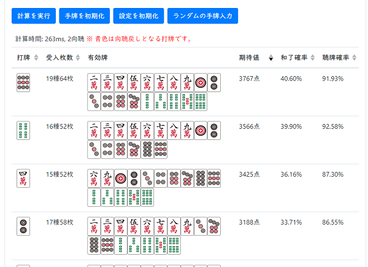

# mahjong-cpp

## About

日本のリーチ麻雀のルールで、点数や期待値計算を行う C++ ライブラリです。

Miscellaneous programs about Japanese Mahjong

## 麻雀何切るシミュレーター

このライブラリを使った期待値計算機能を Web アプリにしたものを以下に公開しています。

[麻雀何切るシミュレーター](https://pystyle.info/apps/mahjong-nanikiru-simulator/)



アプリの紹介: [麻雀 - 期待値計算ツール 何切るシミュレーター](https://pystyle.info/mahjong-nanikiru-simulator/)

## Reference

アルゴリズムに関しましては、以下のページを参考にさせていただいております。

- [tomohxx](https://github.com/tomohxx) 氏: [麻雀アルゴリズム](https://tomohxx.github.io/mahjong-algorithm-book/)
  得点期待値、和了確率、向聴数などのアルゴリズムや実装方法について紹介されています。
- [zurukumo](https://github.com/zurukumo) 氏: [ネット上の向聴数計算アルゴリズムの知見に勝手に補足する](https://zenn.dev/zurukumo/articles/93ae2c381cbe6d)
- KamichanR 氏: [【麻雀】シャンテン数 高速計算アルゴリズム #C++ - Qiita](https://qiita.com/KamichanR/items/de08c48f92834c0d1f74)
- [Cryolite](https://github.com/Cryolite) 氏: [A Fast and Space-Efficient Algorithm for Calculating Deficient Numbers (a.k.a. Shanten Numbers).pdf](https://www.slideshare.net/slideshow/a-fast-and-space-efficient-algorithm-for-calculating-deficient-numbers-a-k-a-shanten-numbers-pdf/269706674)
  牌の組み合わせの効率的なハッシュ化の方法について紹介されています。
- あら氏: [あらの（一人）麻雀研究所](https://mahjong.ara.black/)
  何切る練習ソフト[一人麻雀練習機](https://ara.moo.jp/mjhmr/)を公開しており、仕組みについて紹介されています。

## Features

- [x] Shanten Number Calculation (向聴数計算)
- [x] Necessary Tile Calculation (有効牌計算)
- [x] Unnecessary Tile Calculation (不要牌計算)
- [x] Score Calculation (点数計算)
- [x] Expected Score Calculation (聴牌確率/和了確率/期待値計算)
- [x] English support

## Requirements

- C++17 (See [C++ compiler support - cppreference.com](https://en.cppreference.com/w/cpp/compiler_support))
- [Boost C++ Libraries](https://www.boost.org/) >= 1.66
- [CMake](https://cmake.org/) >= 3.5

## How to build

### Windows

- [CMake](https://cmake.org/download/)
- Visual Studio 2019 or 2022

### Linux

Clone repogitory and build program.

```bash
git clone https://github.com/nekobean/mahjong-cpp.git
cd mahjong-cpp
mkdir build && cd build
# If you want the output to be in English, add the -DLANG_EN option (cmake .. -DLANG_EN)
cmake ..
make -j$(nproc)
make install
```

Run sample program.

```bash
cd install/bin
sample_create_hand
sample_expected_score_calculation
sample_necessary_tile_calculation
sample_score_calculation
sample_shanten_number_calculation
sample_unnecessary_tile_calculation
```

### Build on Docker container

Build and run container.

```bash
docker build . --tag mahjong-cpp
docker run -itP --name mahjong-cpp mahjong-cpp
```

Build program on the created container.

```bash
git clone https://github.com/nekobean/mahjong-cpp.git
cd mahjong-cpp
mkdir build && cd build
cmake ..
make -j$(nproc)
make install
```

## Usage

- [Syanten Number Calculation (向聴数計算)](src/samples/sample_shanten_number_calculation.cpp)
- [Score Calculation (点数計算)](src/samples/sample_score_calculation.cpp)
- [Necessary Tile Calculation (有効牌計算)](src/samples/sample_necessary_tile_calculation.cpp)
- [Unnecessary Tile Selection (不要牌選択)](src/samples/sample_necessary_tile_calculation.cpp)
- [Expected Score Calculation (期待値計算)](src/samples/sample_expected_score_calculation.cpp)

### Set hand and melds

```cpp
#include <iostream>

#include "mahjong/mahjong.hpp"

int main(int argc, char *argv[])
{
    using namespace mahjong;

    // Create hand by mpsz notation.
    // 1m~9m: manzu, 0m: red5m
    // 1p~9p: pinzu, 0p: red5p
    // 1s~9s: souzu, 0s: red5s
    // 1z=East, 2z=South, 3z=West, 4z=North, 5z=White, 6z=Green, 7z=Red
    Hand hand1 = from_mpsz("222567345p333s22z");
    // Convert hand to mpsz notation string by to_string().
    std::cout << to_mpsz(hand1) << std::endl;

    // Create hand by list of tiles.
    Hand hand2 = from_array({Tile::Manzu2, Tile::Manzu2, Tile::Manzu2, Tile::Manzu5,
                             Tile::Manzu6, Tile::Manzu7, Tile::Pinzu3, Tile::Pinzu4,
                             Tile::Pinzu5, Tile::Souzu3, Tile::Souzu3, Tile::Souzu3,
                             Tile::South, Tile::South});
    std::cout << to_mpsz(hand2) << std::endl;

    // Create melds by specifying meld type and tiles.
    // MeldType::Pong      : pong (ポン)
    // MeldType::Chow      : chow (チー)
    // MeldType::ClosedKong: closed kong (暗槓)
    // MeldType::OpenKong  : open kong (明槓)
    // MeldType::AddedKong : added kong (加槓)
    std::vector<Meld> melds = {
        {MeldType::AddedKong, {Tile::East, Tile::East, Tile::East, Tile::East}},
        {MeldType::Pong, {Tile::Manzu1, Tile::Manzu1, Tile::Manzu1}},
    };

    for (const auto &meld : melds) {
        std::cout << to_string(meld) << " ";
    }
    std::cout << std::endl;
}
```

### Shanten number calculation

```cpp
#include <iostream>

#include "mahjong/mahjong.hpp"

int main(int argc, char *argv[])
{
    using namespace mahjong;

    // Create hand by mpsz notation or vector of tiles.
    Hand hand = from_mpsz("222567m34p33667s");
    // Hand hand = from_array({Tile::Manzu2, Tile::Manzu2, Tile::Manzu2, Tile::Manzu5,
    //                          Tile::Manzu6, Tile::Manzu7, Tile::Pinzu3, Tile::Pinzu4,
    //                          Tile::Souzu3, Tile::Souzu3, Tile::Souzu6, Tile::Souzu6,
    //                          Tile::Souzu7});
    // number of melds.
    int num_melds = 0;
    // Calculate minimum shanten number of regular hand, Seven Pairs and Thirteen Orphans.
    auto [shanten_type, shanten] =
        ShantenCalculator::calc(hand, num_melds, ShantenFlag::All);
    std::cout << "shanten type: ";
    for (int type : {ShantenFlag::Regular, ShantenFlag::SevenPairs,
                        ShantenFlag::ThirteenOrphans}) {
        if (shanten_type & type) {
            std::cout << ShantenFlag::Name.at(type) << " ";
        }
    }
    std::cout << std::endl;
    std::cout << "shanten: " << shanten << std::endl;
}
```

### Neccesary tile calculation

```cpp
#include <iostream>

#include "mahjong/mahjong.hpp"

int main(int argc, char *argv[])
{
    using namespace mahjong;

    // Create hand by mpsz notation or vector of tiles.
    Hand hand = from_mpsz("222567m34p33667s");
    // number of melds.
    int num_melds = 0;

    // Calculate necessary tiles.
    auto [shanten_type, shanten, tiles] =
        NecessaryTileCalculator::select(hand, num_melds, ShantenFlag::All);

    std::cout << "shanten: " << shanten << std::endl;
    for (auto tile : tiles) {
        std::cout << Tile::Name.at(tile) + " ";
    }
    std::cout << std::endl;
}
```

### Unnecessary tile calculation

```cpp
#include <iostream>

#include "mahjong/mahjong.hpp"

int main(int argc, char *argv[])
{
    using namespace mahjong;

    // Create hand by mpsz notation or vector of tiles.
    Hand hand = from_mpsz("222567m34p33667s1z");
    // number of melds.
    int num_melds = 0;

    // Calculate unnecessary tiles.
    auto [shanten_type, shanten, tiles] =
        UnnecessaryTileCalculator::select(hand, num_melds, ShantenFlag::All);

    std::cout << "shanten: " << shanten << std::endl;
    for (auto tile : tiles) {
        std::cout << Tile::Name.at(tile) + " ";
    }
    std::cout << std::endl;
}

```

### Score Calculation

```cpp
#include <iostream>

#include "mahjong/mahjong.hpp"

int main(int argc, char *argv[])
{
    using namespace mahjong;

    // Set round infomation.
    /////////////////////////////////////////////////////
    Round round;
    round.rules = RuleFlag::RedDora | RuleFlag::OpenTanyao;
    round.wind = Tile::East;
    round.kyoku = 1;
    round.honba = 0;
    round.kyotaku = 1;
    round.dora_indicators = {Tile::North};
    round.uradora_indicators = {Tile::Pinzu9};
    // If specifying dora, use set_dora().
    // round.set_dora({Tile::East}), round.set_uradora({Tile::Pinzu1});

    // Set player information
    Hand hand = from_mpsz("222567345p333s22z");
    Player player;
    player.hand = hand;
    player.melds = {};
    player.wind = Tile::East;
    const int win_tile = Tile::South;
    const int flag = WinFlag::Tsumo | WinFlag::Riichi;

    // Calculate score.
    const Result result = ScoreCalculator::calc(round, player, win_tile, flag);
    std::cout << to_string(result) << std::endl;
}
```

```output
[入力]
手牌: 222345567p333s22z
副露牌:
自風: 1z
自摸
[結果]
面子構成: [222p 暗刻子][345p 暗順子][567p 暗順子][333s 暗刻子][22z 暗対子]
待ち: 単騎待ち
役:
 門前清自摸和 1翻
 立直 1翻
40符2翻
和了者の獲得点数: 4900点, 子の支払い点数: 1300点
```

### Expected Score Calculation

```cpp
const auto [stats, searched] = ExpectedScoreCalculator::calc(config, round, player);
```

```txt
=== Player ===
手牌: 026m1358p1345579s
副露牌:
自風: 1z
=== Necessary Tiles ===
2m type: 13, sum: 45, shanten: 3->3 tiles: 4m(4) 7m(4) 1p(3) 2p(4) 4p(4) 5p(3) 8p(3) 1s(3) 2s(4) 5s(2) 6s(4) 8s(4) 9s(3)
6m type: 25, sum: 86, shanten: 3->4 tiles: 1m(4) 2m(3) 3m(4) 4m(4) 5m(3) 6m(3) 7m(4) 1p(3) 2p(4) 3p(3) 4p(4) 5p(3) 6p(4) 7p(4) 8p(3) 9p(4) 1s(3) 2s(4) 3s(3) 4s(3) 5s(2) 6s(4) 7s(3) 8s(4) 9s(3)
1p type: 11, sum: 38, shanten: 3->3 tiles: 2m(3) 4m(4) 7m(4) 4p(4) 8p(3) 1s(3) 2s(4) 5s(2) 6s(4) 8s(4) 9s(3)
3p type: 23, sum: 80, shanten: 3->4 tiles: 1m(4) 2m(3) 3m(4) 4m(4) 7m(4) 1p(3) 2p(4) 3p(3) 4p(4) 5p(3) 6p(4) 7p(4) 8p(3) 9p(4) 1s(3) 2s(4) 3s(3) 4s(3) 5s(2) 6s(4) 7s(3) 8s(4) 9s(3)
5p type: 11, sum: 38, shanten: 3->3 tiles: 2m(3) 4m(4) 7m(4) 2p(4) 8p(3) 1s(3) 2s(4) 5s(2) 6s(4) 8s(4) 9s(3)
8p type: 13, sum: 45, shanten: 3->3 tiles: 2m(3) 4m(4) 7m(4) 1p(3) 2p(4) 4p(4) 5p(3) 1s(3) 2s(4) 5s(2) 6s(4) 8s(4) 9s(3)
1s type: 13, sum: 45, shanten: 3->3 tiles: 2m(3) 4m(4) 7m(4) 1p(3) 2p(4) 4p(4) 5p(3) 8p(3) 2s(4) 5s(2) 6s(4) 8s(4) 9s(3)
3s type: 22, sum: 77, shanten: 3->4 tiles: 1m(4) 2m(3) 3m(4) 4m(4) 7m(4) 1p(3) 2p(4) 3p(3) 4p(4) 5p(3) 6p(4) 7p(4) 8p(3) 9p(4) 1s(3) 2s(4) 3s(3) 4s(3) 5s(2) 6s(4) 8s(4) 9s(3)
4s type: 6, sum: 24, shanten: 3->3 tiles: 4m(4) 7m(4) 2p(4) 4p(4) 2s(4) 8s(4)
5s type: 10, sum: 35, shanten: 3->3 tiles: 2m(3) 4m(4) 7m(4) 1p(3) 2p(4) 4p(4) 5p(3) 8p(3) 1s(3) 8s(4)
7s type: 23, sum: 80, shanten: 3->4 tiles: 1m(4) 2m(3) 3m(4) 4m(4) 7m(4) 1p(3) 2p(4) 3p(3) 4p(4) 5p(3) 6p(4) 7p(4) 8p(3) 9p(4) 1s(3) 2s(4) 3s(3) 4s(3) 5s(2) 6s(4) 7s(3) 8s(4) 9s(3)
9s type: 10, sum: 35, shanten: 3->3 tiles: 2m(3) 4m(4) 7m(4) 1p(3) 2p(4) 4p(4) 5p(3) 8p(3) 1s(3) 6s(4)
0m type: 26, sum: 90, shanten: 3->4 tiles: 1m(4) 2m(3) 3m(4) 4m(4) 5m(3) 6m(3) 7m(4) 8m(4) 1p(3) 2p(4) 3p(3) 4p(4) 5p(3) 6p(4) 7p(4) 8p(3) 9p(4) 1s(3) 2s(4) 3s(3) 4s(3) 5s(2) 6s(4) 7s(3) 8s(4) 9s(3)

=== Tenpai Probability ===
turn      2m      6m      1p      3p      5p      8p      1s      3s      4s      5s      7s      9s      0m
   1  77.78%  63.40%  73.33%  64.54%  72.73%  77.76%  77.70%  57.13%  63.05%  72.35%  65.84%  73.15%  61.26%
   2  74.19%  59.09%  69.44%  60.15%  68.82%  74.17%  74.11%  52.42%  58.49%  68.41%  61.50%  69.26%  57.08%
   3  70.15%  54.45%  65.12%  55.40%  64.48%  70.12%  70.07%  47.44%  53.59%  64.05%  56.77%  64.93%  52.58%
   4  65.62%  49.46%  60.35%  50.29%  59.71%  65.59%  65.56%  42.23%  48.37%  59.25%  51.66%  60.15%  47.78%
   5  60.59%  44.16%  55.14%  44.86%  54.50%  60.55%  60.54%  36.85%  42.87%  54.02%  46.21%  54.93%  42.68%
   6  55.04%  38.59%  49.49%  39.14%  48.88%  55.00%  55.01%  31.38%  37.16%  48.38%  40.44%  49.28%  37.34%
   7  48.98%  32.84%  43.45%  33.23%  42.88%  48.94%  48.97%  25.92%  31.34%  42.36%  34.46%  43.24%  31.82%
   8  42.45%  27.02%  37.10%  27.26%  36.59%  42.41%  42.47%  20.60%  25.54%  36.07%  28.38%  36.88%  26.23%
   9  35.55%  21.31%  30.55%  21.40%  30.10%  35.52%  35.59%  15.58%  19.93%  29.59%  22.38%  30.30%  20.72%
  10  28.41%  15.85%  23.95%  15.84%  23.59%  28.40%  28.49%  11.04%  14.69%  23.09%  16.61%  23.69%  15.49%
  11  21.28%  10.83%  17.52%  10.74%  17.25%  21.29%  21.39%   7.15%  10.03%  16.78%  11.30%  17.25%  10.68%
  12  14.49%   6.50%  11.57%   6.37%  11.39%  14.52%  14.61%   4.04%   6.13%  10.98%   6.73%  11.31%   6.49%
  13   8.50%   3.12%   6.49%   3.01%   6.40%   8.53%   8.60%   1.81%   3.17%   6.08%   3.19%   6.25%   3.18%
  14   3.86%   0.93%   2.72%   0.87%   2.69%   3.87%   3.90%   0.49%   1.23%   2.49%   0.93%   2.55%   0.98%
  15   1.00%   0.00%   0.59%   0.00%   0.59%   1.00%   1.00%   0.00%   0.26%   0.51%   0.00%   0.51%   0.00%
  16   0.00%   0.00%   0.00%   0.00%   0.00%   0.00%   0.00%   0.00%   0.00%   0.00%   0.00%   0.00%   0.00%
  17   0.00%   0.00%   0.00%   0.00%   0.00%   0.00%   0.00%   0.00%   0.00%   0.00%   0.00%   0.00%   0.00%
  18   0.00%   0.00%   0.00%   0.00%   0.00%   0.00%   0.00%   0.00%   0.00%   0.00%   0.00%   0.00%   0.00%
=== Win Probability ===
turn      2m      6m      1p      3p      5p      8p      1s      3s      4s      5s      7s      9s      0m
   1  20.98%  13.34%  18.74%  14.83%  18.11%  20.90%  21.03%  12.00%  13.59%  18.11%  15.39%  18.92%  12.37%
   2  18.24%  11.26%  16.15%  12.54%  15.60%  18.17%  18.30%   9.99%  11.45%  15.58%  13.05%  16.30%  10.46%
   3  15.60%   9.31%  13.67%  10.39%  13.20%  15.54%  15.65%   8.13%   9.45%  13.16%  10.84%  13.80%   8.68%
   4  13.07%   7.52%  11.33%   8.41%  10.94%  13.03%  13.12%   6.45%   7.62%  10.88%   8.79%  11.43%   7.03%
   5  10.70%   5.90%   9.16%   6.60%   8.84%  10.66%  10.74%   4.96%   5.97%   8.76%   6.93%   9.23%   5.54%
   6   8.50%   4.47%   7.18%   5.01%   6.93%   8.47%   8.54%   3.67%   4.51%   6.84%   5.27%   7.23%   4.21%
   7   6.51%   3.24%   5.43%   3.63%   5.24%   6.49%   6.55%   2.59%   3.27%   5.14%   3.84%   5.45%   3.07%
   8   4.76%   2.22%   3.91%   2.50%   3.77%   4.76%   4.80%   1.72%   2.25%   3.68%   2.65%   3.91%   2.12%
   9   3.28%   1.42%   2.64%   1.60%   2.55%   3.28%   3.31%   1.06%   1.44%   2.48%   1.70%   2.63%   1.37%
  10   2.09%   0.82%   1.64%   0.92%   1.59%   2.09%   2.11%   0.59%   0.84%   1.53%   0.98%   1.62%   0.80%
  11   1.19%   0.41%   0.90%   0.45%   0.88%   1.19%   1.20%   0.28%   0.44%   0.83%   0.49%   0.88%   0.40%
  12   0.57%   0.16%   0.41%   0.17%   0.40%   0.57%   0.58%   0.10%   0.19%   0.37%   0.19%   0.40%   0.16%
  13   0.21%   0.04%   0.14%   0.04%   0.14%   0.21%   0.21%   0.02%   0.06%   0.12%   0.04%   0.13%   0.04%
  14   0.04%   0.00%   0.02%   0.00%   0.02%   0.04%   0.04%   0.00%   0.01%   0.02%   0.00%   0.02%   0.00%
  15   0.00%   0.00%   0.00%   0.00%   0.00%   0.00%   0.00%   0.00%   0.00%   0.00%   0.00%   0.00%   0.00%
  16   0.00%   0.00%   0.00%   0.00%   0.00%   0.00%   0.00%   0.00%   0.00%   0.00%   0.00%   0.00%   0.00%
  17   0.00%   0.00%   0.00%   0.00%   0.00%   0.00%   0.00%   0.00%   0.00%   0.00%   0.00%   0.00%   0.00%
  18   0.00%   0.00%   0.00%   0.00%   0.00%   0.00%   0.00%   0.00%   0.00%   0.00%   0.00%   0.00%   0.00%
=== Expected Score ===
turn       2m       6m       1p       3p       5p       8p       1s       3s       4s       5s       7s       9s       0m
   1  1977.33  1100.60  1879.30  1423.04  1563.48  1962.67  2012.92  1030.85  1147.32  1527.20  1439.02  1876.73   657.61
   2  1708.40   914.72  1611.65  1197.01  1336.88  1695.64  1740.36   852.95   959.71  1305.29  1214.49  1609.69   548.25
   3  1450.86   744.79  1357.37   986.44  1122.43  1439.93  1479.08   690.49   786.63  1095.18  1004.38  1355.79   448.35
   4  1207.23   591.96  1118.95   793.45   922.10  1198.08  1231.68   544.52   629.35   898.92   810.67  1117.48   358.43
   5   980.21   456.97   899.04   619.63   738.09   972.76  1000.88   416.06   489.18   718.58   635.48   897.46   278.62
   6   772.55   340.53   700.34   466.90   572.51   766.77   789.49   305.84   367.10   556.24   480.71   698.46   209.28
   7   586.71   242.92   524.82   336.44   427.10   582.53   600.37   214.37   263.73   413.78   347.79   522.58   150.57
   8   425.13   163.65   374.39   228.93   303.42   422.42   435.69   141.37   179.40   292.77   237.79   371.89   102.52
   9   289.94   102.20   250.62   144.54   202.49   288.36   297.56    86.14   113.80   194.24   151.08   247.97    64.94
  10   182.30    57.47   154.10    82.53   124.12   181.51   187.38    47.12    65.74   118.14    86.86   151.62    37.22
  11   102.21    27.78    83.93    40.54    67.36   101.89   105.33    22.06    33.31    63.55    42.82    81.90    18.45
  12    48.20    10.49    37.95    15.45    30.37    48.11    49.80     7.98    13.90    28.20    16.39    36.50     7.17
  13    17.01     2.38    12.46     3.50     9.97    17.00    17.60     1.70     4.19     8.95     3.73    11.62     1.68
  14     3.29     0.00     2.04     0.00     1.66     3.29     3.40     0.00     0.65     1.35     0.00     1.73     0.00
  15     0.00     0.00     0.00     0.00     0.00     0.00     0.00     0.00     0.00     0.00     0.00     0.00     0.00
  16     0.00     0.00     0.00     0.00     0.00     0.00     0.00     0.00     0.00     0.00     0.00     0.00     0.00
  17     0.00     0.00     0.00     0.00     0.00     0.00     0.00     0.00     0.00     0.00     0.00     0.00     0.00
  18     0.00     0.00     0.00     0.00     0.00     0.00     0.00     0.00     0.00     0.00     0.00     0.00     0.00
```
